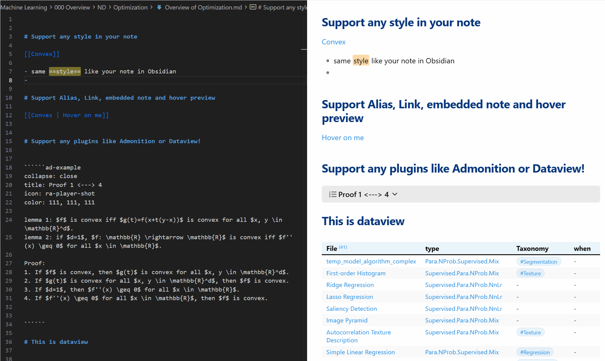

# Obsidian for Cursor

> **Preview & navigate your Obsidian vault while coding with AI.**

---

## Why?

Cursor/VS Code is great for AI-assisted editing. Obsidian is great for knowledge management. This plugin bridges them — **preview your notes with full Obsidian rendering while you code**.

---

## Features

- **Live Preview** — Dataview, Admonition, callouts, all rendered
- **Click to Navigate** — `[[wikilinks]]` and `[[File#Heading]]` work
- **Hover Preview** — See linked notes without switching files
- **Syntax Highlighting** — Wikilinks, tags, embeds colored in editor
- **Wikilink Completion** — Type `[[` to get file suggestions with alias support
- **Collapsible Callouts** — Expand/collapse just like Obsidian
- **Imgur Upload** — Paste images directly to Imgur with `Ctrl+Shift+V` (requires [Obsidian Imgur Plugin](https://github.com/gavvvr/obsidian-imgur-plugin), Windows only)
- **Connection Status** — Clear feedback when Obsidian isn't running

---

## Install

### 1. Obsidian Plugin (Under review)
Settings → Community Plugins → Browse → **"Cursor Integration"** → Install
> This project is under review by Obsidian team, you can manually install it by following the [Manual Installation Guide](INSTALL.md)

### 2. Cursor / VS Code Extension
Search `obsidianpreview` in Extensions and install

---

## Usage

1. Open Obsidian (with plugin enabled)
2. Open your vault in Cursor/VS Code
3. Open any `.md` file → Click the 👁️ icon or run `Obsidian Preview: Open Preview`

---

## Support

If you find this useful, consider supporting the project ☕

支付宝 / Alipay

微信支付 / WeChat Pay

---

## License

MIT © px39n
